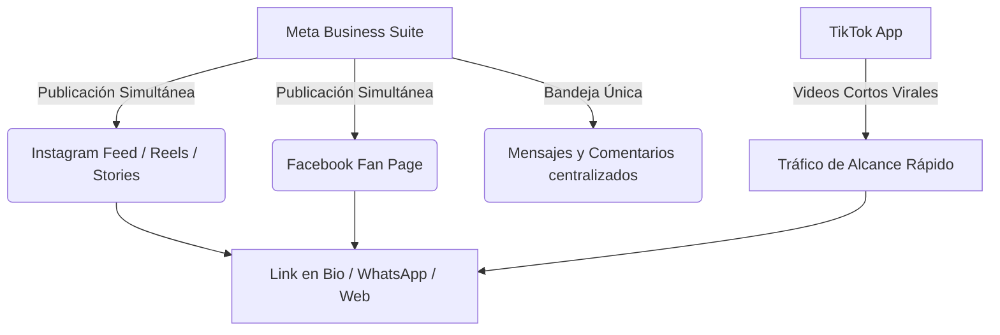

# Estrategia de Dominio Digital: El Cóndor Climatización
**Ecosistema de Captación B2B y B2C a través de Meta Business Suite y TikTok**

---

## 1. El Ecosistema Digital (La Maquinaria)

Al haber descargado **Meta Business Suite**, diste el paso más importante para ahorrar tiempo. Esta herramienta actúa como tu **Centro de Comando de Marketing**: te permite controlar Facebook e Instagram al mismo tiempo desde una sola aplicación.

> [!IMPORTANT]
> **Regla de Oro:** Nunca publiques por separado en Facebook y luego en Instagram. Programá y subí todo desde **Meta Business Suite** para que salga en ambas redes a la vez. TikTok se maneja desde su propia app nativa, pero **el mismo video vertical (Reel) que creás para Instagram se recicla y se sube a TikTok**. ¡Un solo esfuerzo, triple impacto!

---

## 2. La Estrategia de Contenidos: "Ingeniería Preventiva en Acción"

Para captar clientes de alto valor (locales comerciales en Puerto Madero, empresas, casas premium), no tenés que bailar ni hacer tendencias vacías. **Tu contenido debe posicionarte como el ingeniero/técnico experto que resuelve problemas costosos.**

### El Embudo de 3 Fases

| Fase | Plataforma | Formato | Objetivo | Frecuencia |
| :--- | :--- | :--- | :--- | :--- |
| **1. Atracción** | TikTok / IG Reels | Videos verticales cortos (30-60 seg) | Captar desconocidos mostrando el "Detrás de Escena" y problemas reales. | 3 veces por semana |
| **2. Autoridad** | IG Feed / FB Page | Carruseles (fotos Antes/Después) y Tips B2B | Generar confianza absoluta demostrando prolijidad técnica y uso de herramientas premium. | 2 veces por semana |
| **3. Conversión** | IG / FB Stories | Historias diarias con encuestas y links | Convertir seguidores en prospectos enviándolos a tu WhatsApp o Web Oficial. | Diario (en campo) |

---

## 3. El Paso a Paso para Crear Videos Ganadores (Reels & TikToks)

El formato en video vertical es el rey absoluto. Cada vez que estés en un servicio de 8 a 16 hs, usá tu celular para grabar clips rápidos de 5 segundos. 

### Estructura del Guion Perfecto de 45 Segundos

1. **El Gancho (Primeros 3 segundos):** Tiene que retener al usuario de inmediato.
   * *Ejemplo Visual:* Mostrando la pantalla térmica (termografía) o un compresor congelado/sucio.
   * *Frase hablada:* *"Por esto un local gastronómico en Puerto Madero estaba pagando el doble de luz..."* o *"No cambies tu aire acondicionado antes de revisar esta pieza de $5.000."*
2. **El Desarrollo del Problema (15 segundos):**
   * Explicás técnicamente pero en palabras sencillas qué estaba fallando (falta de mantenimiento preventivo, consumo excesivo de amperaje, riesgo de cortocircuito).
3. **La Solución El Cóndor (15 segundos):**
   * Mostrás en cámara rápida cómo realizás la limpieza profunda, medición de presiones o el recambio profesional dejando todo impecable.
4. **El Llamado a la Acción - CTA (Últimos 5 segundos):**
   * *"Si querés garantizar la continuidad operativa de tu negocio este verano y evitar que tus equipos colapsen, hacé clic en el link de mi perfil para un diagnóstico preventivo."*

> [!TIP]
> **Reciclaje Inteligente:** Grabá el video vertical una sola vez en tu celular. Subilo primero a **TikTok**. Luego, abrís **Meta Business Suite** y subís ese mismo video como **Reel**, programándolo para Facebook e Instagram.

---

## 4. Historias Diarias (Stories): Tu Arma de Venta Directa

Las Historias duran 24 horas y las ven las personas que ya confían en vos. Es el lugar ideal para vender de forma directa y casual.

* **Lunes de Motivación Operativa:** Foto desde la camioneta a las 7:30 AM con tu café y el logo de El Cóndor. Texto: *"Arrancando la semana garantizando el clima ideal para nuestros clientes corporativos."*
* **Miércoles de Interacción (Encuesta):** Subí una foto de un filtro completamente tapado de tierra. Pregunta interactiva: *"¿Hace cuánto no revisás los filtros de tu oficina?"* -> Opciones: `[Hace menos de 6 meses]` / `[Ni me acuerdo 💀]`. A todos los que voten la segunda opción, les mandás un mensaje directo ofreciendo el servicio.
* **Viernes de Testimonio / Cierre:** Captura de pantalla de un mensaje de WhatsApp de un cliente agradecido o foto del equipo funcionando perfecto. Etiqueta de Link directa a tu agendador o web.

---

## 5. Optimización de Perfiles (Para Convertir Visitas en Clientes)

Asegurate de que las biografías de tu Instagram, Facebook y TikTok tengan esta estructura profesional:

> **EL CÓNDOR CLIMATIZACIÓN** 🦅
> ⚡ Ingeniería Preventiva y Continuidad Operativa B2B/B2C.
> 🌡️ Diagnóstico por Termografía y Control de Consumo Eléctrico.
> 📍 Atención en CABA, GBA y Puerto Madero.
> 👇 **Agendá tu diagnóstico técnico oficial aquí:**
> `[Link hacia tu GitHub Pages / Web Oficial]`

---

## 6. Tu Rutina Semanal de Marketing (Integrada a tu Vida)

No necesitás dedicarle 5 horas al día. Integralo a tu planificador de vida de la siguiente manera:

* **Durante la jornada de trabajo (8 a 16 hs):** Solo grabás clips sueltos con el celular. No editás nada en el momento. Si ves algo interesante (un antes/después impactante), sacás foto.
* **En el bloque de Prospección (16:00 a 17:30 hs):** 
  * Dedicás 20 minutos a unir los videos en el celular (podés usar la app gratuita **CapCut** o el mismo editor de TikTok/Reels).
  * Entrás a **Meta Business Suite**, respondés todos los mensajes acumulados en un solo lugar.
  * Dejás programado el video o carrusel para que se publique automáticamente a las **19:00 hs** (horario pico donde la gente sale de trabajar y mira el celular).

> [!NOTE]
> **Pauta Publicitaria Estratégica (Opcional a futuro):** Cuando tengas un Reel que orgánicamente haya tenido muchas vistas o consultas, podés usar el botón "Promocionar" en Meta Business Suite invirtiendo $2.000 o $3.000 pesos por día, segmentando específicamente a dueños de negocios en un radio de 5 km alrededor de Puerto Madero o tu zona de interés.

---

## 7. Calendario Maestro de Captura Diaria (Qué hacer de Lunes a Domingo)

Para que el lote del domingo fluya solo, esta es tu hoja de ruta diaria en el campo:

### 🔴 Lunes: Foco en "El Arranque Operativo"
* **En el momento (Historia de 24hs):** Foto del mate/café en la camioneta a las 7:30 AM o llegando al primer cliente. Texto: *"Garantizando el clima operativo para arrancar la semana."*
* **Para guardar (Materia prima para el Domingo):** Grabá un clip de 5 segundos de las herramientas ordenadas o midiendo con el manómetro.

### 🔴 Martes: Foco en "El Problema Oculto"
* **En el momento (Historia de 24hs):** Subí una foto de un equipo desarmado o una placa electrónica. Texto: *"Mantenimiento correctivo en proceso."*
* **Para guardar (Materia prima para el Domingo):** Grabá el Antes (el equipo sucio/fallando) y el Después (limpio y funcionando). ¡Clip clave para Reels!

### 🔴 Miércoles: Foco en "Interacción B2B"
* **En el momento (Historia de 24hs):** Foto de un filtro completamente tapado. **Sticker de Encuesta:** *"¿Hace cuánto no revisás los filtros de tu oficina/local?"* -> Opciones: `[Menos de 6 meses]` / `[Ni me acuerdo 💀]`.
* **Para guardar (Materia prima para el Domingo):** Grabá la pantalla de la cámara termográfica mostrando un punto caliente o sobrecalentamiento eléctrico.

### 🔴 Jueves: Foco en "Autoridad y Precisión"
* **En el momento (Historia de 24hs):** Foto de la pinza amperométrica midiendo el consumo exacto. Texto: *"Optimizando el consumo eléctrico para evitar facturas sorpresa."*
* **Para guardar (Materia prima para el Domingo):** Clip corto de la unidad exterior (condensadora) en un techo o balcón premium.

### 🔴 Viernes: Foco en "Cliente Satisfecho / Fin de Semana"
* **En el momento (Historia de 24hs):** Captura de pantalla de un WhatsApp de un cliente agradeciendo la rapidez, o foto del equipo cerrado y prolijo. Etiqueta con Link directo a tu web/WhatsApp.
* **Para guardar (Materia prima para el Domingo):** Video selfie corto (opcional) o paneo general del local comercial terminado.

### 🟢 Sábado o Domingo: "El Comando de Lote" (Batching)
* **Acción:** Te sentás 2 horas. Me pasás el reporte de los videos que juntaste en la semana.
* **Mi parte:** Te redacto los copies y guiones maestros.
* **Tu cierre:** Entrás a **Meta Business Suite**, programás los 3 Reels y 2 posteos fijos para que salgan solos durante la semana entrante a las 19:00 hs. ¡Misión cumplida!
