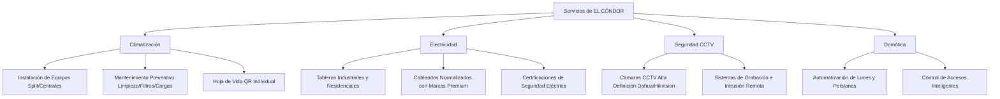

# 🦅 MANUAL DE MARCA Y ESTRATEGIA: EL CÓNDOR

Este documento reelabora y optimiza el manual original de **EL CÓNDOR - Servicios Integrales**. Se han integrado de forma estratégica los diferenciales técnicos reales (trazabilidad QR, marcas líderes, servicio llave en mano) y se ha profesionalizado la redacción y estructura para uso corporativo.

---

## 1. Identidad Corporativa

### Quiénes Somos
**EL CÓNDOR - Servicios Integrales** es una empresa de soluciones técnicas de alto estándar especializada en climatización, electricidad, seguridad electrónica (CCTV) y domótica. Diseñada para dar cobertura integral a hogares, barrios cerrados (countries), comercios, consorcios y pymes, nos destacamos por implementar procesos tecnológicos de trazabilidad y utilizar únicamente componentes de primera línea para garantizar la seguridad y continuidad operativa de cada propiedad.

### Propósito
> **Garantizar la seguridad, el confort y la continuidad operativa de cada propiedad a través de ingeniería técnica confiable y transparente.**

### Misión
Brindar soluciones profesionales llave en mano en climatización, electricidad y seguridad de forma ágil y transparente. Nos apoyamos en la trazabilidad digital de equipos y el uso exclusivo de materiales líderes de mercado, promoviendo el uso seguro y eficiente de la energía y la tecnología.

### Visión
Consolidarse para el año 2030 como la empresa proveedora de mantenimiento y servicios técnicos integrales de referencia en CABA y el Gran Buenos Aires, destacada por su digitalización operativa, la honestidad en el diagnóstico y la excelencia en contratos de abono corporativo.

---

## 2. Valores y Pilares de Marca

*   **Honestidad Técnica:** Evaluamos el estado real de los componentes y aconsejamos solo lo necesario para el cliente.
*   **Seguridad Eléctrica y Operativa:** Cero tolerancia al uso de materiales deficientes; las instalaciones deben proteger vidas y activos.
*   **Transparencia Digital:** Información abierta sobre el historial técnico de cada equipo mediante código QR.
*   **Compromiso Llave en Mano:** Presupuestos todo incluido (mano de obra + materiales premium) para evitar costos sorpresa y asegurar la calidad de la instalación.

---

## 3. Posicionamiento y Propuesta de Valor

### Posicionamiento
**EL CÓNDOR** se posiciona como el *Socio Técnico de Confianza* para propiedades residenciales y comerciales de nivel medio-alto y alto. No competimos por el precio más bajo del mercado, sino por la **calidad y durabilidad de los materiales, la transparencia del presupuesto y el control tecnológico del mantenimiento**.

### Propuesta de Valor (Value Proposition)
> **"Mantenimiento técnico profesional con trazabilidad digital y materiales líderes, garantizando soluciones definitivas sin sorpresas en el presupuesto."**

---

## 4. Diferenciales Competitivos Claros (Key Differentiators)

| Diferencial | Enfoque de EL CÓNDOR | Lo que hace la competencia |
| :--- | :--- | :--- |
| **Trazabilidad QR** | Cada equipo cuenta con una etiqueta QR única adherida que contiene su **Hoja de Vida digital**. Permite al cliente y al técnico consultar mantenimientos previos, repuestos instalados y fechas de control. | Planillas de papel que se pierden o inexistencia de registros históricos de los equipos. |
| **Materiales Líderes** | Uso exclusivo de marcas líderes mundiales: **ABB, Siemens, Schneider, Kalop, Prysmian, Interelec, Genrod, Rocket, Dahua, Hikvision, Uniview**. | Materiales genéricos, cables subnormalizados o cámaras sin marca para abaratar costos a corto plazo. |
| **Servicio Llave en Mano** | Presupuestos cerrados que incluyen mano de obra y materiales aprobados. Si el cliente provee sus materiales, se realiza una **auditoría estricta de calidad** previo a la instalación. | Presupuestos imprecisos donde faltan cables o insumos que se cobran aparte en plena obra. |
| **Garantía Técnica Escrita** | Todos los trabajos cuentan con garantía formal documentada, respaldada por la hoja de vida digital del equipo. | Trabajos informales sin canales claros de reclamo o soporte técnico posventa. |

---

## 5. Segmentación del Cliente Ideal (Buyer Personas)

### Prioridad 1: Clientes Comerciales y Corporativos (B2B)
*   **Pymes y Comercios (Restaurantes, Oficinas, Clínicas):** Requieren continuidad operativa. Su principal dolor es la pérdida de dinero por fallas en el aire acondicionado o la electricidad.
*   **Barrios Cerrados / Countries:** Propietarios que valoran la seguridad interna, la discreción y técnicos matriculados con trazabilidad.
*   **Industrias y Fábricas:** Demandan abonos mensuales de mantenimiento preventivo para evitar paradas de planta.

### Prioridad 2: Consorcios y Administradores (B2G/B2B)
*   **Administradores de Consorcio:** Buscan un proveedor único que les solucione electricidad de espacios comunes, bombas de agua, CCTV de ingreso y mantenimiento de equipos comunes. Valoran los informes digitales rápidos y la trazabilidad para poder mostrar transparencia a los copropietarios.

### Prioridad 3: Hogares y Residenciales (B2C)
*   Dueños de casa o inquilinos que buscan instalaciones estéticas, seguras (domótica y electricidad) y un trato confiable y educado al ingresar a la propiedad.

---

## 6. Portafolio de Servicios Detallado

---

## 7. Objetivos Estratégicos (SMART)

### Corto Plazo (1 Año)
*   **Clientes:** Consolidar 50 clientes activos en cartera.
*   **Recurrentes:** Firmar abonos recurrentes con al menos 5 comercios/restaurantes.
*   **Consorcios:** Lograr la primera administración de consorcios bajo abono mensual integral.
*   **Tecnología:** Implementar el 100% de la trazabilidad QR en todos los nuevos servicios.

### Mediano Plazo (3 Años)
*   **Estructura:** Disponer de 2 cuadrillas operativas independientes y equipadas.
*   **Abonos:** Consolidar 15 contratos de abono mensual de mantenimiento técnico.
*   **Geografía:** Liderar la presencia de servicios técnicos y de instalación en Zona Sur (Avellaneda, Quilmes, Bernal, La Plata).

### Largo Plazo (5 Años)
*   **Escala:** Contar con 4 cuadrillas operativas y un coordinador de despacho digital.
*   **Contratos:** Alcanzar 30 contratos activos de abono técnico (foco en countries y pymes industriales).
*   **Reconocimiento:** Ser la marca líder en mantenimiento con trazabilidad QR en Buenos Aires.

---

## 8. Identidad Visual y Comunicación

### Paleta de Colores Corporativa
*   **Azul Cóndor (Dominante):** `#0B3C5D` (Representa profesionalismo, seguridad, estabilidad e institucionalidad).
*   **Gris Acero / Blanco (Soporte):** `#F9F9F9` y `#328CC1` (Aporta limpieza, tecnología y contraste moderno).
*   **Amarillo Alerta / Oro (Acento):** `#D9B310` (Representa energía, electricidad y sirve para destacar llamados a la acción o advertencias técnicas de seguridad).

### Tipografía Sugerida
*   **Títulos principales (Encabezados):** `Montserrat` o `Outfit` (Tipografía sans-serif fuerte, geométrica y de alta legibilidad técnica).
*   **Cuerpo del texto:** `Inter` o `Open Sans` (Limpia, moderna, ideal para lectura en pantallas y reportes PDF de trazabilidad QR).

### Tono de Voz y Comunicación
*   **Profesional:** Explicamos los fallos técnicos de forma clara, sin lenguaje excesivamente informal ni demasiado técnico indescifrable.
*   **Transparente:** Si algo tiene arreglo, lo reparamos; si requiere cambio de repuesto, documentamos el motivo con fotos y en la hoja de vida QR.
*   **Cercano y Educado:** Comunicación ágil y respetuosa con los administradores y vecinos.

---

## 9. Plan de Crecimiento y Acciones Comerciales

*   **Fase 1: Digitalización y CRM (Actual):** Consolidación de la base de leads con el Buscador de Leads y campañas automatizadas a Consorcios y Restaurantes por correo y LinkedIn.
*   **Fase 2: Venta de Trazabilidad QR:** Utilizar el QR como gancho comercial para los administradores de consorcios y locales de gastronomía, mostrándoles cómo esto les ahorra reportes y llamadas de reclamos.
*   **Fase 3: Alianzas y Abonos Mensuales:** Ofrecer abonos preventivos trimestrales o mensuales a comercios y fábricas para asegurar la continuidad de su negocio (ej: mantenimiento invernal/estival de aires).
*   **Fase 4: Expansión de Cuadrillas:** Delegar la operación técnica y expandir el alcance territorial a toda el área metropolitana de Buenos Aires.
